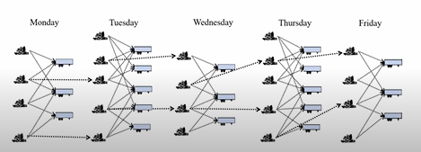
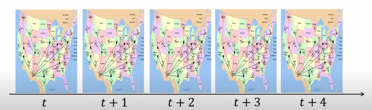
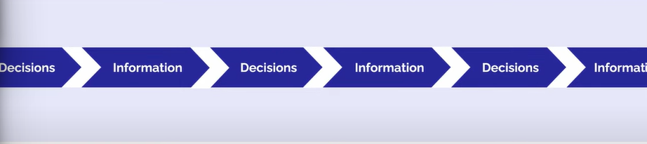
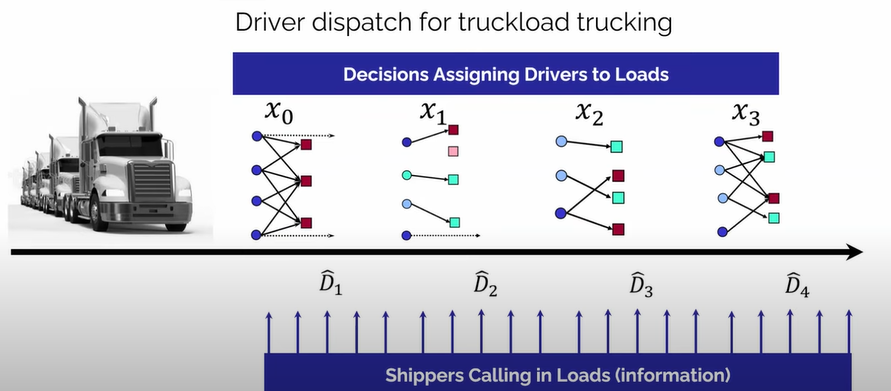

# What are we (or Optimal Dynamics) trying to do
**Refresh on the Old Way**: "Classical optimization" taken as a surrogate. This is how people have [traditionally](https://youtu.be/hOmfamEOyko?si=xReyKOd2fCM-UMhR&t=1786) tried to solve complex problems. (LPP - snapshots in time.)

**Expose Its Biggest Flaw**: Real-world problems aren't static snapshots. They are sequential. You make a decision, new information comes in (e.g., a shipment is delayed, a customer changes an order), and you have to decide again. The "optimal" answer from 5 minutes ago might now be terrible.

**OD Way**: "Universal framework" for Sequential Decision Analytics. This is a powerful method for making decisions over time in the face of uncertainty. It's not about finding one perfect answer, but about creating smart policies (rules for making decisions) that adapt as the future unfolds.

# The Classical Optimization Strategy 
Pose the Problem: Formulate the decision problem as a mathematical optimization model for a single point in time.

Example: Linear Programming
Design a Solution Algorithm: Use an algorithm to solve the model.

Example: Simplex Method
Declare the Solution as Optimal: The resulting solution is considered the optimal decision.

Example: Production Plan

## Nature of a Sequential Optimization Problem: 

*It's standard to focus on a problem at a point in time, when in practice it iterates over and again. Flows through the network are dynamic and stochiastic*

*Information keeps arriving, but decisions need to be made periodically as well*

## Trucking Problem at hand:

*xi : scenario i  
Di: ith  peice of new information* 

# From Static to Sequential 
#### 1\. The Static Policy (your rulebook for making optimal decisions at a given time)

  * **What it is:** A simplified "surrogate" optimization problem.
  * **Formula:** $$X^{\pi}(S_t|\theta) = \arg\min_{x \in X_t(\theta)} c^T(\theta)x_t + g(x_t, \theta), \quad \pi = (f \in F | \theta \in \Theta^f)$$
  * **You choose:**
      * The **type of model** (`f`).
      * The **tuning knobs** (`&theta;`).

#### 2\. The Objective Function (The Scorecard)

This is how you measure the **true performance** of your policy over the entire timeline. You find this score by simulating.

  * **What it does:** Sums up the **actual costs** (`C`) of your decisions over time.
  * **How it works:** The system state (`S`) changes based on your decision (`x`) and **new random information** (`W`).
  * **Formula:** $$F^{\pi}(\theta) = \sum_{t=0}^{T} C(S_t, X^{\pi}(S_t|\theta)) \quad \text{where } S_{t+1} = S^M(S_t, x_t = X^{\pi}(S_t|\theta), W_{t+1})$$

#### 3\. The Stochastic Optimization Problem (The Ultimate Goal)

This is the "real" problem: finding the absolute best policy that performs best **on average** over all possible random futures.

  * **What it is:** The search for the best policy and its best tuning.
  * **It minimizes:** The **Expected** (`E`) long-term cost.
  * **Formula:** $$F^*(S_0) = \min_{f \in F} \min_{\theta \in \Theta^f} E[F^{\pi}(\theta)|S_0]$$

---

# First, What is a "Policy"?

Before looking at the different types, let's define what a **policy** is.

In simple terms, a policy is your **rulebook for making decisions**.

It is *not* the decision itself, but the *method* or *strategy* you use to choose a decision based on the current situation. Think of it as a machine: you feed it the current state of the world (your information), and it tells you what action to take.

* **A Decision is:** "Send Truck #5 to the warehouse in Agra." (A one-time action).
* **A Policy is:** "Whenever a truck becomes available, calculate the most profitable route from its current location and send it there." (The ongoing rule you use to make all such decisions).

The goal in sequential decision problems is not to find one perfect action, but to design the best possible **policy** that will consistently make good decisions over time as the situation changes.

The matrix below explains the different *types* of rulebooks you can create.

---

### Matrix of Policy Types

| Policy Type | Core Idea (In Simple Terms) | How It Works | Analogy / Example | How It Handles Uncertainty |
| :--- | :--- | :--- | :--- | :--- |
| **1. PFA** (Policy Function Approx.) | A simple "if-then" rule or a fixed formula. | It directly maps the current state to a decision using a pre-determined rule, with no optimization at decision time. | **Thermostat:** "If the temperature is below 22°C, turn on the AC." It's a simple, unchanging rule. | **Poorly.** The rule is static and doesn't adapt to changes in future uncertainty, only to the current state. |
| **2. CFA** (Cost Function Approx.) | Making a decision by solving a simplified optimization model with "padded" costs to be safe. | It takes a standard optimization model and modifies its parameters (e.g., costs, times) to implicitly create a buffer against risk. | **Adding Buffer Time:** When planning a trip, you solve for the fastest route but add 20 minutes to every leg of the journey "just in case." | **Indirectly.** It doesn't model randomness, but it bakes in a "fudge factor" or safety stock to be robust against it. |
| **3. VFA** ([Value Function Approx.](https://youtu.be/hOmfamEOyko?si=gqmE-ZyX6-nvWrdE&t=2107)) | Choosing the action that leads to the most "valuable" future situation. | For each possible decision, it uses a function to estimate the long-term value of the state you would land in, then picks the decision leading to the best future state. | **Chess Grandmaster:** They don't just think about the piece they can capture now; they make the move that leads to a superior board position (a state with high "value"). | **Yes, implicitly.** The "value" of a future state is an approximation of the expected outcome of all random possibilities that could unfold from there. |
| **4a. Det-DLA** (Deterministic Lookahead) | Planning for the future by assuming the most likely outcome will happen. | It creates a single, deterministic forecast of the future and finds the best sequence of actions for that *one* specific future. | **Google Maps' First Suggestion:** It calculates the "fastest route" based on average traffic data, assuming no unexpected accidents will occur. | **Ignores it.** It explicitly assumes the future is certain and follows a single predicted path. |
| **4b. Stoch-DLA** (Stochastic Lookahead) | Planning for the future while actively considering multiple random possibilities. | It models the future as a tree of different possible scenarios and finds a decision that is robustly good across many of those potential outcomes. | **Retirement Planning:** Instead of assuming a fixed 7% return every year, a financial planner runs simulations with market crashes and booms to find a strategy that works well in many scenarios. | **Explicitly.** This is its entire purpose. It directly models and plans for future randomness to make a robust decision now. |

# A six-step modeling process

It is possible to divide the entire modeling process into six steps (for our purposes):

**Step 1. The narrative**
This will be a plain English description of the problem. The narrative will not provide all the information needed to create a mathematical model; rather, it is a first step that should give the modeler the big picture without getting lost in notation.

**Step 2. Identifying the core elements of the problem**
This involves special emphasis on three dimensions of any sequential decision problem. These elements are described without using mathematics:
* **What metrics are we trying to impact?** Individual fields (such as supply chain management, health, energy, finance) will each be characterized by a number of metrics that might be described using terms such as costs, revenues, profits, rewards, gains, losses, performance and risk.
* **What decisions are being made?** Identifying decisions is quite easy for many problems such as computer games, but if we address a complex problem such as responding to a public health crisis, reducing the carbon footprint, or managing a supply chain, then identifying all the decisions can be quite challenging.
* **What are the different sources of uncertainty?** What are we uncertain about before we start? What information arrives exogenously over time (that is, arrives after we make a decision)?

**Step 3. The mathematical model**
Here we build off the first three elements from Step 2, but now we have to create a mathematical model that consists of five dimensions that apply to every sequential decision problem:
* **State variables $S_t$** - The state variable captures everything you need to know at time $t$ to make a decision at time $t$, compute costs and constraints, and if necessary, simulate your way to time $t + 1$.
* **Decision variables $x_t$** - These describe how we are going to design or control our system. Decisions have to satisfy constraints that we write as $x_t \in X$. Decisions will be determined by policies that are functions (or rules) that we designate by $X^{\pi}(S_t)$ that determine $x_t$ given what is in the state variable.
* **Exogenous information $W_{t+1}$** - This is new information that arrives after we make decision $x_t$ (but before we decide $x_{t+1}$) such as how much we sell after setting a price, or the time to complete the path we chose.
* **The transition function $S^M(S_t, x_t, W_{t+1})$** - These are the equations that describe how the state variables evolve over time. We write the evolution of the state variables $S_t$ using our transition function as:
    $$S_{t+1} = S^M(S_t, x_t, W_{t+1})$$
    where $S^M(\cdot)$ is known as the state (or system) transition model.
* **The objective function** - This captures the performance metrics we use to evaluate our performance, and provides the basis for searching over policies. We let $C(S_t, x_t)$ = the contribution (if maximizing) or cost (if minimizing) of decision $x_t$. Our most common way of writing the objective function is:
    $$\max_{\pi} E \left( \sum_{t=0}^{T} C(S_t, X^{\pi}(S_t)) | S_0 \right)$$

**Step 4. The uncertainty model**
This is how we model the different types of uncertainty. We have three ways of modeling the exogenous information process:
* Create a mathematical model of $W_1, W_2, \dots, W_T$.
* Use observations from history, such as past prices, sales, or weather events.
* Run the system in the field, observing $W_t$ as they happen.

**Step 5. Designing policies**
Policies are functions, so we have to search for the best function. We do this by identifying two core strategies:
* Search over a family of functions to find the one that works best, on average, over time.
* Create a policy by estimating the immediate cost or contribution of a decision $x_t$, plus an approximation of future costs or contributions, and then finding the choice $x_t$ that optimizes the sum of current and future costs or contributions.

**Step 6. Evaluating policies**
Finding the best policy means evaluating policies to determine which is best. Most often we assume policies can be evaluated in a simulator, but simulators can be complex and difficult to build, and are still subject to modeling approximations. For this reason, the vast majority of practical problems encountered in practice tend to involve testing in the field, which introduces its own set of issues.

# References
1. https://castle.princeton.edu/wp-content/uploads/2022/11/Powell-SDAM-Nov242022_final_w_frontcover.pdf
2. https://youtu.be/hOmfamEOyko?si=gqmE-ZyX6-nvWrdE&t=2107
